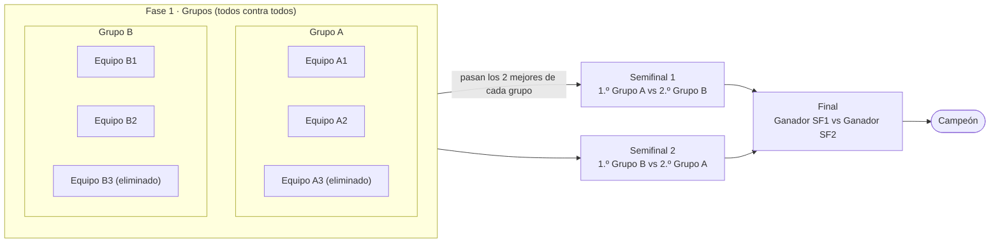
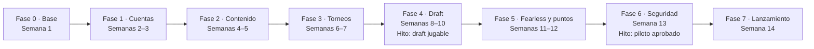

# Plan de implementación — Sabana Rivers Draft

Actualizado: 3 de octubre de 2026 · Autor: Santiago


## Resumen y correcciones al brief

Sabana Rivers Draft es la web del semillero de esports Sabana Rivers. Tiene tres pestañas (Sabana Rivers, Torneos y Draft) y un simulador de draft de League of Legends en formato Fearless, sincronizado en tiempo real entre los dos equipos. Sobre Draftlol mejora tres cosas: integra torneos y tabla de puntos, maneja cuentas de equipo con logo y trae un panel de administración que permite editar la web sin tocar código.

**Objetivos de la primera versión (MVP)**

1. Los equipos se registran, suben su logo y se inscriben en torneos.
2. El admin crea torneos, grupos, partidos y eventos, y edita los textos de la web desde un panel.
3. Dos equipos hacen un draft Fearless en ventanas separadas y sincronizadas, con espectadores.
4. Cuando se registra el resultado de una serie, la tabla de posiciones se actualiza sola.

**Correcciones y aclaraciones al texto original**

- **Nombre:** se usa "Sabana Rivers Draft" (no "Savannah River"), igual que en el logo.
- **Backend en JavaScript:** se hace con Node.js usando *Vercel Serverless Functions* (carpeta `/api`). La sincronización en vivo no puede ir ahí, porque esas funciones no mantienen conexiones abiertas. Para eso se usa **Supabase Realtime**.
- **"Inicia el lado azul piqueando, exclusivamente para dañarlo":** lo interpreto como *baneando*. El draft empieza con la fase de bans y el lado azul hace el primer ban. El orden completo está en la sección del módulo Draft.
- **Fearless (punto 5, corregido):** el draft de cada partida es completo, con 5 bans y 5 picks por equipo. En las siguientes partidas de la misma serie (BO3/BO5), los campeones **pickeados** en partidas anteriores quedan bloqueados. Los bans no se arrastran y se reinician en cada partida. El administrador elige en cada torneo entre Hard Fearless (bloqueo para ambos equipos, como en las ligas oficiales) y Soft Fearless (bloqueo solo para el equipo que lo pickó).
- **Puntos (punto 6):** las reglas, tal como están escritas, se cruzan entre sí. Por ejemplo, un empate no puede darse en un BO3. Decisión: el administrador define los puntos de cada torneo. Los empates en la tabla se rompen por objetivos (dragones y torres).
- **Imágenes de campeones:** vienen del CDN oficial de Riot (Data Dragon), usando las skills que ya están en el código. No se suben a Supabase.
- **Diseño de referencia:** el draft sigue la captura tipo Draftlol, el resto de la web parte del afiche del torneo y la vista de espectador sigue la referencia de escenario con splash arts.

**Decisiones confirmadas (iteración 2)**

| Tema | Decisión |
| --- | --- |
| Torneos | Son modulares: el administrador define puntos, fases, límite de equipos y grupos. Por ahora el máximo es 10 equipos; el torneo actual tiene 6 |
| Organizador y patrocinadores | La cuenta principal (superadmin) sube los logos del organizador (p. ej. Claro Gaming), la imagen del torneo y su información |
| Desempate | Por objetivos (dragones y torres): el que tenga más queda primero en la fase de grupos |
| Eliminatorias | Bracket con logo, nombre y rival de cada equipo. Ejemplo: 6 equipos en 2 grupos de 3, pasan los 2 mejores de cada grupo |
| Moneda | Asigna el lado solo en la fase de todos contra todos (grupos) |
| Fearless | El administrador elige Hard o Soft en cada torneo |
| Registro de resultado | Lo hace cualquiera de los dos equipos que tenga la web abierta durante el partido |
| Login | Solo con correo |
| Repositorio | WebSabanaRivers: README y carpeta `.skills/` con las guías de campeones, roles e imágenes |

**Decisiones confirmadas (iteración 3)**

| Tema | Decisión |
| --- | --- |
| Lados en eliminatorias | El mejor clasificado elige si juega lado azul o rojo |
| Cruces del bracket | 1.º contra 2.º de grupos distintos: 1.º A vs 2.º B y 1.º B vs 2.º A |
| Desempate | Pesan más los dragones: puntos, luego dragones, luego torres |
| Formato de serie | El admin elige BO1, BO3 o BO5 por fase, y los equipos lo ven en la sala |
| Fin de partida | Al cerrar el draft arranca un contador de duración. Cada capitán pulsa "Terminar encuentro" y responde por separado quién ganó y cuántas torres y dragones consiguió su equipo |
| Capitán ausente | El resultado queda pendiente hasta que ese capitán vuelva a entrar a la web |
| Transmisión | No se transmite nada. La vista de espectador es solo para el admin, con un diseño propio |
| Diseño | El draft sigue la referencia tipo Draftlol; el resto de la web parte del afiche del torneo (fondo negro, circuitos azul y rojo) |

**Decisiones confirmadas (iteración 4)**

| Tema | Decisión |
| --- | --- |
| Logos | Cada equipo sube el suyo (capitán), y el admin también puede subirlo o cambiarlo. Los del organizador y patrocinadores los sube el admin |
| Contador de partida | Se detiene en cuanto uno de los dos capitanes pulsa "Terminar encuentro" |
| Diseño | Vista de bracket sin calendario; se agrega la vista del capitán durante el draft; el Inicio pasa a un estilo más gaming, con animaciones |

## Stack y arquitectura

El frontend es React (Vite) y se publica en Vercel. Supabase pone la base de datos Postgres, la autenticación, el almacenamiento de logos y el tiempo real. Las acciones delicadas pasan por funciones Node.js en `/api`: picks y bans del draft, lanzamiento de moneda y registro de resultados.

| Capa | Tecnología | Responsabilidad |
| --- | --- | --- |
| Frontend | React 18 + Vite, React Router, TanStack Query, Tailwind CSS, Zustand (estado del draft) | Interfaz, pestañas, panel admin, vista de draft |
| Backend | Node.js en Vercel Serverless Functions (`/api/*`), validación con Zod | Lógica autoritativa: turnos del draft, moneda, Fearless, resultados y puntos |
| Base de datos | Supabase Postgres + Row Level Security (RLS) | Torneos, equipos, partidos, drafts, contenido editable |
| Tiempo real | Supabase Realtime (Postgres Changes + Broadcast + Presence) | Sincronizar las ventanas de azul, rojo, admin y espectadores; contar conectados |
| Archivos | Supabase Storage (buckets `team-logos` y `tournament-assets`) | Logos de equipos, logos de organizador y patrocinadores, banners de torneos |
| Autenticación | Supabase Auth (solo correo y contraseña) | Cuentas de capitanes y admins |
| Imágenes de campeones | Data Dragon de Riot (CDN oficial) | Retratos, splash arts y loading screens |
| Despliegue | Vercel (preview por rama, producción en `main`) | Hosting del front y de `/api` |

**Principio clave: el servidor manda.** El navegador nunca escribe directamente un pick o un ban en la base de datos. Envía una petición a `/api/draft/action`, y la función revisa que sea el turno de ese equipo, que el token sea válido, que el campeón esté disponible (sin ban, sin pick previo y fuera del bloqueo Fearless) y que el tiempo no haya vencido. Solo entonces guarda la acción con la llave de servicio. Supabase Realtime propaga el cambio a todas las ventanas en menos de un segundo.

**Estructura de carpetas propuesta**

```
sabana-rivers-draft/
  .skills/             # guías existentes del repo WebSabanaRivers
  api/                 # funciones serverless (Node)
    draft/  match/  coin/  admin/  teams/
  scripts/
    seed-roles.js      # convierte el listado de roles en seed.sql
  src/
    app/               # rutas y layout
    features/          # home, torneos, draft, equipos, admin
    components/        # UI reutilizable (botones, tarjetas, bloques CMS)
    lib/               # supabase client, ddragon, utilidades
  supabase/
    migrations/        # SQL versionado (tablas, RLS, funciones)
    seed.sql
```

## Identidad visual y diseño

El punto de partida es el logo: una garza blanca sobre negro, en estilo minimalista. La web pública toma el estilo del afiche del torneo: fondo negro, líneas de circuito azules a la izquierda y rojas a la derecha, tablas con borde blanco y una tipografía display ancha. La pantalla de draft de los equipos sigue la referencia tipo Draftlol, y la vista de espectador del admin sigue la referencia de escenario con splash arts.

### Referencias y diseño propuesto

El diseño está en el canvas [Sabana Rivers Draft — Diseño web](https://claude.ai/artifact/GiydA6qwWyhfTHDD8zNoiX), con cinco pantallas: Inicio (con animaciones), Torneo (bracket), vista del capitán durante el draft (interactiva: filtra por rol y elige campeón), Espectador del admin y el momento del pick.

| Pantalla | Referencia | Qué se toma |
| --- | --- | --- |
| Inicio y Torneos | Afiche del torneo | Fondo negro, circuitos azul/rojo, logos de Sabana Rivers y del organizador arriba, tablas de grupo con Letra, Equipo y Puntos (se agregan Dragones y Torres) |
| Draft de cada equipo | Captura tipo Draftlol | Picks grandes a los lados, bans abajo, nombres de equipo arriba, filtros por rol, buscador y botón Listo / Bloquear |
| Espectador del admin | Escenario con splash arts | Paneles inclinados con la splash de cada pick, nombres de equipo arriba y campeones ya jugados en la serie abajo |


**Vista de espectador (solo admin).** No se transmite nada; esta vista es para que el admin siga el draft. Arriba van los dos equipos con su logo, el juego de la serie, la fase y el tiempo. Al centro, cinco paneles inclinados por lado. Cuando un equipo bloquea un campeón, su splash completa ocupa la pantalla unos segundos y luego se reduce hasta su panel. Debajo están los bans y una franja con los campeones jugados en partidas anteriores de la serie, que Fearless ya no deja repetir.

**Paleta (tokens CSS / Tailwind)**

| Token | Color | Uso |
| --- | --- | --- |
| `--sr-black` | `#0A0E14` | Fondo general |
| `--sr-navy` | `#0B1F3A` | Tarjetas, barras, panel del equipo azul |
| `--sr-blue` | `#1E5AA8` | Botones primarios, enlaces, foco |
| `--sr-sky` | `#4FB3FF` | Acentos, turno activo, temporizador |
| `--sr-white` | `#F5F7FA` | Texto principal, logo |
| `--sr-gray` | `#8A94A6` | Texto secundario, bordes |
| `--sr-red` | `#D23A4A` | Lado rojo: circuitos, equipo rojo en el draft y en el espectador |

El rojo viene del afiche: junto con el azul representa los dos lados del mapa, así que aparece en los circuitos decorativos y en todo lo que identifica al equipo rojo.

**Tipografía:** *Alfa Slab One* para títulos, con letras espaciadas como en el afiche, y *Barlow* / *Barlow Condensed* para texto y etiquetas. Todas están en Google Fonts.

**Sugerencias de mejora frente a Draftlol**

- **Responsive de verdad:** la vista de draft se reorganiza en móvil, con los equipos arriba y abajo y la grilla de campeones en el centro.
- **Turno visible:** el slot activo pulsa en azul cielo, el temporizador es una barra que se vacía y aparece un aviso claro de "Tu turno". En Draftlol el turno se pierde fácilmente.
- **Campeones bloqueados por Fearless:** en la grilla se muestran en gris con un candado y un tooltip que indica en qué partida y por qué equipo se usaron.
- **Contador de partida:** al cerrar el draft, ambas ventanas muestran la duración de la partida y el botón "Terminar encuentro".
- **Logos de equipo:** aparecen en la barra superior del draft, en la tabla de posiciones, en el bracket y en el espectador.
- **Accesibilidad:** contraste AA, navegación con teclado en la grilla y estados que no dependen solo del color (iconos y texto).
- **Idioma:** interfaz en español, con los nombres de los campeones tal como los entrega Data Dragon en `es_MX`.

## Estructura de la web: tres pestañas

La navegación tiene tres pestañas públicas: **Sabana Rivers**, **Torneos** y **Draft**. A eso se suman una zona privada de equipo ("Mi equipo") y el panel de administración (`/admin`), visible solo para admins. El contenido de las pestañas públicas se construye con bloques que el admin edita (ver la sección del panel de administración).

| Pestaña | Ruta | Contenido |
| --- | --- | --- |
| Sabana Rivers (inicio) | `/` | Hero con logo y la frase "Somos semillero de esports". Si hay torneos activos, arriba aparece un banner por torneo que explica el formato, la fase de grupos, cómo funciona el draft (Fearless, BO3) y las fechas. Más abajo van quiénes somos, próximos eventos y redes |
| Torneos | `/torneos`, `/torneos/:slug` | Listado de torneos (activos, próximos, finalizados). En el detalle: reglamento, grupos con tabla de posiciones (PJ, G, E, P, puntos), calendario de partidos, resultados, bracket de eliminatorias con logo y nombre de cada equipo, y logos del organizador y patrocinadores |
| Draft | `/draft`, `/draft/:id`, `/draft/:id/:token` | Entrada a un match: crear uno nuevo (desde un partido del torneo o amistoso) o ingresar con código o enlace. Contiene la sala de espera, la moneda y el tablero del draft |
| Mi equipo | `/equipo` | Registro del equipo, logo, integrantes, inscripción a torneos, historial de drafts |
| Admin | `/admin/*` | Torneos, partidos, eventos, contenido de la web, equipos, usuarios, auditoría |

**Regla del banner de torneos activos:** se muestra en el inicio cuando un torneo tiene `estado = 'activo'`. El texto que explica el torneo, los grupos y el draft sale de los campos que el admin llena al crear el torneo. Cuando el torneo pasa a `finalizado`, el banner desaparece sin que nadie toque código.

## Módulo de torneos

Cada torneo se crea con un asistente donde el administrador decide todo: puntos, fases, límite de equipos, grupos, modo Fearless, organizador y patrocinadores. Los equipos se inscriben y el admin los acomoda en grupos. Ningún paso requiere tocar código.

### Asistente de creación

1. **Información:** nombre, slug, descripción, reglamento, fechas, estado e imagen principal del torneo (la foto o arte de lo que se va a hacer).
2. **Organizador y patrocinadores:** este paso solo lo ve la cuenta principal (`superadmin`). Incluye el texto "Organizado por" con su logo (por ejemplo, Claro Gaming) y una lista ordenable de patrocinadores con logo, nombre y enlace. Los archivos van al bucket `tournament-assets` y se reprocesan con `sharp`, igual que los logos de equipo.
3. **Cupos e inscripción:** el límite de equipos lo pone el admin. Hoy el tope global es 10, guardado en `settings` y editable solo por el superadmin. También se definen las fechas de inscripción y si la aprobación es manual o automática.
4. **Fases:** el admin arma una lista ordenada de fases. Cada fase es de tipo **Grupos (todos contra todos)** o **Eliminatoria (bracket)**.
    - En grupos se configuran el número de grupos, el formato de serie (BO1, BO3 o BO5, que los equipos ven en la sala del draft), si hay ida y vuelta y cuántos equipos clasifican por grupo.
    - En eliminatoria se configura el formato de cada ronda (por ejemplo, semifinal BO3 y final BO5) y el cruce de siembra.
5. **Puntos:** el admin llena la tabla de puntuación por tipo de resultado (`scoring_rules`).
6. **Draft:** Hard o Soft Fearless y tiempo por acción.
7. **Revisar y publicar:** vista previa de la página del torneo y del banner del inicio antes de publicar.

### Inscripción y acomodo de equipos

- El capitán solicita la inscripción desde "Mi equipo". Si el cupo está lleno, el equipo queda en lista de espera.
- El admin ve las solicitudes y las aprueba hasta llegar al límite.
- Luego acomoda los equipos en los grupos arrastrándolos (drag & drop) o con un botón de sorteo aleatorio.
- Con los grupos listos, un clic genera el calendario todos contra todos. El admin puede mover fechas después.

### Tabla de grupos y desempate por objetivos

Al terminar cada partida, cada capitán reporta por separado las **torres** que derribó y los **dragones** que tomó su equipo. Si dos equipos empatan en puntos, queda primero el que tenga más dragones en la fase; si siguen empatados, el que tenga más torres.

| Orden | Criterio |
| --- | --- |
| 1 | Puntos |
| 2 | Dragones en la fase |
| 3 | Torres en la fase |
| 4 | Enfrentamiento directo |

Los objetivos se escriben a mano porque Riot no ofrece de forma abierta los datos de partidas personalizadas. Por eso existe la confirmación del rival y la revisión del admin en caso de disputa.

### Clasificación y bracket

Cuando la fase de grupos termina, el sistema toma los clasificados de cada grupo según la tabla y genera el bracket cruzando 1.º contra 2.º de grupos distintos (1.º A vs 2.º B y 1.º B vs 2.º A). El admin puede ajustarlo antes de publicarlo. Cada llave muestra el logo, el nombre y el marcador de los dos equipos, y el ganador avanza solo cuando se registra el resultado. Si clasifica un número de equipos que no es potencia de 2, los mejores sembrados pasan directo (bye).

**Ejemplo de bracket: 6 equipos, 2 grupos de 3**



En el torneo actual de 6 equipos, el 1.º de un grupo enfrenta al 2.º del otro, y los ganadores van a la final. En la web, cada equipo del bracket aparece con su logo y su nombre.

### Lados en cada fase

- **Grupos (todos contra todos):** la moneda del servidor asigna el lado de cada equipo.
- **Eliminatorias:** no hay moneda. El mejor clasificado (más puntos en la fase de grupos) elige si juega en el lado azul o en el rojo. Desde la segunda partida elige el perdedor de la anterior.

## Módulo Draft

Cada match es una serie (BO1, BO3 o BO5) con su propia sala. Cada partida de la serie tiene un draft de torneo completo: 20 acciones por partida, 5 bans y 5 picks por equipo. Las reglas Fearless se aplican entre partidas. Todo el estado vive en Supabase y cada ventana lo recibe por Realtime.

### Flujo de una serie

1. **Crear match:** el admin, o un capitán autorizado, lo crea desde un partido del torneo o como amistoso. Se eligen el formato (BO1/BO3/BO5), el modo Fearless (lo hereda del torneo: Hard o Soft), el tiempo por acción (30 s por defecto) y el método de lados.
2. **Equipos:** si el match viene de un partido del torneo, los dos equipos ya están asignados con nombre y logo. En un amistoso, cada capitán escribe el nombre de su equipo. Si el equipo está registrado, su logo aparece automáticamente.
3. **Lados (moneda o elección):** el servidor lanza la moneda con `crypto.randomInt`, así nadie puede manipularla desde el navegador. Ambas ventanas ven la misma animación y el mismo resultado: "*Equipo X* le tocó el lado azul". La moneda solo se usa en la fase de grupos (todos contra todos); en eliminatorias elige lado el mejor sembrado. También se puede activar el modo **"Elegir manualmente"**, donde los equipos o el admin fijan los lados sin moneda. Desde la partida 2, por defecto elige lado el perdedor de la partida anterior.
4. **Sala de espera:** se generan los enlaces de azul y rojo; la vista de espectador queda dentro del panel del admin. Cada equipo pulsa "Listo" y el draft empieza cuando ambos lo están.
5. **Draft:** azul y rojo, cada uno en su ventana, siguen el orden de 20 acciones. Cada lado solo puede actuar en su turno.
6. **Partida y resultado:** al cerrar el draft arranca un contador con la duración de la partida, visible en las dos ventanas, que se detiene en cuanto uno de los capitanes pulsa Terminar encuentro. Cuando cada capitán pulsa "Terminar encuentro", la web le pregunta quién ganó y, por separado, cuántas torres derribó y cuántos dragones tomó su equipo. Si los dos indican el mismo ganador, el resultado queda confirmado; si no, pasa a disputa y lo resuelve el admin. Si un capitán no responde, el resultado queda pendiente hasta que vuelva a entrar a la web.
7. **Siguiente partida:** se abre un nuevo draft en la misma sala, con los campeones bloqueados por Fearless. Cuando un equipo alcanza las victorias necesarias, la serie se cierra y se actualiza la tabla del torneo.

### Orden de acciones por partida (formato torneo)

| Fase | Acciones en orden |
| --- | --- |
| Bans 1 | Azul, Rojo, Azul, Rojo, Azul, Rojo |
| Picks 1 | Azul, Rojo, Rojo, Azul, Azul, Rojo |
| Bans 2 | Rojo, Azul, Rojo, Azul |
| Picks 2 | Rojo, Azul, Azul, Rojo |

El orden se guarda como plantilla en la base de datos (`draft_templates`). Si en el futuro se quiere otro formato, por ejemplo con más bans, el admin lo cambia sin tocar código.

### Fearless

- **Hard Fearless:** un campeón pickeado por cualquier equipo en una partida anterior de la serie queda bloqueado para ambos en las partidas siguientes.
- **Soft Fearless:** el campeón queda bloqueado solo para el equipo que lo pickó.
- **Los bans nunca se arrastran:** cada partida empieza con sus 10 bans libres.
- **Cómo se calcula:** el servidor consulta los picks de las partidas cerradas de esa serie (`draft_actions` con `type = 'pick'`) y arma la lista bloqueada. La interfaz los muestra en gris con candado, pero el bloqueo real lo hace el servidor, así que un usuario no puede saltarlo editando el HTML.

### Enlaces y permisos (mejorado respecto a Draftlol)

Draftlol usa enlaces con claves (`/sala/admin/azul/rojo`): quien tiene el enlace tiene el control. Aquí se conserva esa comodidad y se le suma seguridad:

| Rol | Acceso | Puede |
| --- | --- | --- |
| Espectador | `/draft/:id` (solo admin) | Ver el draft en vivo con el diseño de espectador (splash arts y campeones ya jugados en la serie) |
| Capitán azul / rojo | `/draft/:id/:token` + sesión iniciada como miembro del equipo (configurable) | Marcar listo, hacer hover, banear y pickear en su turno |
| Admin del match | Panel admin o enlace admin | Pausar, reanudar, deshacer la última acción, reiniciar el temporizador, cambiar lados, registrar el ganador |

Los tokens tienen 32 bytes aleatorios. En la base de datos solo se guarda su hash (SHA-256) y vencen cuando la serie termina. En torneos oficiales, además del enlace, el capitán debe haber iniciado sesión con una cuenta que pertenezca a ese equipo. Así, si alguien filtra el enlace, no puede jugar por el equipo.

### Sincronización y temporizador

- **Estado persistente:** cada acción es una fila en `draft_actions`. Las ventanas se suscriben con *Postgres Changes* filtrado por `game_id`. Si alguien recarga o pierde la conexión, el tablero se reconstruye desde esas filas.
- **Estado efímero:** el campeón que el equipo está mirando (hover) viaja por *Broadcast* y no se guarda. *Presence* muestra cuántos pickers, admins y espectadores hay conectados, igual que el contador de Draftlol.
- **Temporizador autoritativo:** el servidor guarda `deadline_at` en cada turno y el navegador solo dibuja la cuenta regresiva. Como las funciones de Vercel no pueden correr un reloj, cuando el tiempo vence cualquier ventana llama a `/api/draft/timeout`. El servidor confirma que `now() > deadline_at` y aplica la regla: ban vacío en fase de bans y campeón aleatorio disponible en fase de picks (configurable). La llamada es idempotente, así que si llega dos veces no pasa nada.
- **Zona horaria:** todas las marcas de tiempo se guardan en UTC y se muestran en hora de Colombia (UTC−5).

### Lo que se toma de Draftlol y lo que se corrige

| De Draftlol | En Sabana Rivers Draft |
| --- | --- |
| Sin registro para espectar | Cambia: no hay transmisión pública; la vista de espectador es solo para el admin |
| Enlaces por rol con "Copy all" | Se mantiene, con tokens hasheados y vencimiento |
| Indicador de "listo" y contador de conectados | Se mantiene con Supabase Presence |
| Admin puede quitar picks/bans y deshabilitar campeones | Se mantiene, con registro en auditoría |
| Opciones avanzadas que fallan (pantalla en blanco al abrirlas) | Formulario validado con Zod y manejo de errores; nunca deja la app en blanco |
| Sin Fearless visible ni memoria de series | Fearless Hard/Soft con historial de la serie |
| Lados fijos Blue/Red sin moneda | Moneda en servidor (fase de grupos) o elección manual |
| Sin torneos ni puntos | Integrado con torneos, tabla de posiciones y bracket |
| Solo inglés, poco usable en móvil | Español y diseño responsive |

## Resultados y sistema de puntos

Al cerrar cada partida se registra el ganador. Al cerrar la serie, los puntos se asignan con la tabla de puntuación del torneo, que el admin puede editar. Las posiciones se calculan siempre a partir de los resultados guardados y no se escriben a mano, así nunca quedan desactualizadas.

**Ejemplo de puntuación (el administrador la define en cada torneo)**

| Resultado de la serie | Ganador | Perdedor |
| --- | --- | --- |
| BO1 ganado | 3 | 0 |
| BO3 ganado 2-0 | 3 | 0 |
| BO3 ganado 2-1 | 2 | 0 |
| Empate 1-1 (solo en BO2) | 1 | 1 |

En un BO3 no puede haber empate. El empate solo existe si el torneo usa series de 2 partidas, por eso esa fila se activa solo en ese formato. Muchas ligas le dan **1 punto al perdedor de un 2-1** para premiar que ganó una partida. Eso queda como opción en la configuración.

**Desempate en la tabla:** puntos, luego dragones y luego torres, con el orden completo que se detalla en el módulo de torneos.

**Cómo se implementa**

1. Al cerrar el draft arranca el contador de duración, que se detiene cuando el primer capitán pulsa Terminar encuentro. Cada capitán pulsa "Terminar encuentro" y responde por separado quién ganó y cuántas torres y dragones consiguió su equipo. Si los ganadores coinciden, el resultado se confirma; si no, el admin resuelve la disputa. Si un capitán no responde, el resultado espera hasta que vuelva a conectarse.
2. `/api/match/result` valida el permiso y llama a una función SQL transaccional `registrar_resultado(game_id, winner_team_id, objetivos)`.
3. La función guarda el ganador de la partida, revisa si la serie ya está decidida y, si es así, cierra el match y calcula los puntos con `scoring_rules`.
4. La vista `standings` suma los puntos por grupo. Torneos y el banner del inicio se actualizan en vivo por Realtime.
5. El admin puede corregir un resultado. Toda corrección queda en `audit_log` con el valor anterior y el nuevo.

## Panel de administración modular

La web se arma con **bloques de contenido guardados en la base de datos** en lugar de textos fijos en el código. El admin crea, ordena, edita, oculta y publica esos bloques desde `/admin`. React solo sabe dibujar cada tipo de bloque.

**Cómo funciona el sistema de bloques**

- Cada página (`inicio`, `torneos`, `sobre-nosotros`…) es una fila en `pages`.
- Cada página tiene una lista ordenada de `page_blocks` con `type`, `position`, `visible` y un campo `content` en JSON.
- Un componente `BlockRenderer` lee el `type` y dibuja el componente que corresponde. Para agregar un tipo nuevo de bloque hace falta código una sola vez; después el admin lo usa cuantas veces quiera.
- Los cambios tienen **borrador y publicado**, para que el admin pueda previsualizar antes de que lo vea el público.

**Tipos de bloque iniciales**

| Bloque | Campos editables |
| --- | --- |
| Hero | Título, subtítulo, imagen o splash de fondo, botón (texto + enlace) |
| Banner de torneos activos | Se llena solo desde la tabla de torneos; el admin elige si se muestra |
| Texto enriquecido | Contenido con formato (editor TipTap) |
| Tarjetas | Lista de tarjetas con icono, título y texto (p. ej. "Qué es Fearless") |
| Próximos eventos | Se llena desde `events`, con cantidad configurable |
| Galería / Patrocinadores | Imágenes con enlace |
| Redes sociales | Enlaces a Discord, Instagram, TikTok, Twitch |

**Secciones del panel**

1. **Torneos:** el asistente de creación descrito en el módulo de torneos (información, organizador y patrocinadores, cupos, fases, puntos, draft) y la gestión de equipos inscritos.
2. **Grupos y partidos:** crear grupos, asignar equipos (manual o sorteo), generar el calendario todos contra todos con un clic, programar fechas y publicar el bracket.
3. **Drafts:** ver los drafts en curso, entrar como admin, pausar, deshacer, forzar acciones y resolver disputas de resultado.
4. **Eventos:** crear eventos del torneo o del semillero (fecha, lugar o enlace, descripción, imagen).
5. **Contenido:** editar las páginas con los bloques descritos arriba.
6. **Equipos y usuarios:** aprobar equipos, revisar logos, asignar roles y suspender cuentas.
7. **Auditoría:** historial de quién cambió qué y cuándo.

**Roles**

| Rol | Permisos |
| --- | --- |
| `superadmin` | Todo, incluida la gestión de otros admins, el tope global de equipos y los logos de organizador y patrocinadores |
| `admin` | Torneos, partidos, drafts, contenido, equipos |
| `editor` | Solo contenido de la web y eventos |
| `captain` | Su equipo, inscripciones y drafts de su equipo |
| `player` | Ver su equipo y participar si el capitán lo autoriza |

## Registro de equipos y logos

Una persona crea su cuenta, registra el equipo y queda como su capitán. Después sube el logo, invita a sus compañeros e inscribe al equipo en torneos. El logo aparece automáticamente en drafts, tablas, calendarios y el bracket.

1. **Cuenta:** registro solo con correo y contraseña, con verificación de correo. Se crea una fila en `profiles` con nombre de invocador y región opcionales.
2. **Equipo:** nombre único, abreviatura de 2 a 5 letras (tag) y logo. Quien lo crea queda como `captain`.
3. **Logo:** se sube a Supabase Storage en `team-logos/{team_id}/logo.webp`. Reglas: solo PNG, JPG o WEBP, máximo 2 MB. Una función `/api/teams/logo` lo convierte a WEBP de 512×512 con `sharp` y descarta el archivo original. Lo sube el capitán del equipo o un admin, y solo ellos pueden escribir en esa carpeta (política de Storage).
4. **Integrantes:** el capitán comparte un código de invitación que vence en 7 días. El jugador lo ingresa y entra como `player`.
5. **Inscripción:** desde "Mi equipo" el capitán se inscribe en un torneo abierto. Según la configuración del torneo, el admin aprueba o la inscripción es automática.
6. **Moderación:** el admin puede rechazar nombres o logos inapropiados. El equipo sigue existiendo, pero sin logo, hasta que suba otro.

## Imágenes de campeones (Data Dragon)

Ninguna imagen de campeón se guarda en Supabase. Todas salen del CDN oficial de Riot, Data Dragon, a través de las skills que ya existen en el código. En la base de datos solo se guarda el `id` del campeón (por ejemplo `Orianna`) y el número de skin.

| Recurso | URL | Uso en la web |
| --- | --- | --- |
| Versión vigente | `https://ddragon.leagueoflegends.com/api/versions.json` (primer elemento) | Saber qué parche usar |
| Lista de campeones | `.../cdn/{version}/data/es_MX/champion.json` | Grilla, nombres en español |
| Detalle con skins | `.../cdn/{version}/data/es_MX/champion/{id}.json` | Lista `skins[].num` para elegir splash |
| Retrato cuadrado | `.../cdn/{version}/img/champion/{id}.png` | Grilla y slots de ban |
| Splash art | `.../cdn/img/champion/splash/{id}_{num}.jpg` | Fondo del hero, animación al pickear |
| Loading screen | `.../cdn/img/champion/loading/{id}_{num}.jpg` | Slots de pick verticales |

**Cómo se integra**

- Un módulo `lib/ddragon.js` envuelve las skills existentes. Al cargar la app consulta `versions.json` y luego `champion.json`, y guarda la versión en caché por 24 horas. Data Dragon solo cambia con cada parche, así que la recomendación es cachear ([guía de Data Dragon](https://hextechdocs.dev/data-dragon/)).
- El servidor también usa `champion.json` para validar que el campeón enviado exista y para escoger uno aleatorio cuando se acaba el tiempo.
- Cada draft guarda la versión del parche con la que se jugó. Así los historiales antiguos siguen mostrando el campeón correcto aunque cambie el parche.
- Los filtros de rol de la grilla (top, jungla, mid, ADC, support) se guardan en una tabla editable `champion_roles`. Data Dragon solo trae clases (Mage, Tank…), no posiciones, así que el admin puede ajustarlos.
- Aviso legal en el pie de página, como pide la política de Riot para proyectos de la comunidad: "Sabana Rivers Draft no está respaldado por Riot Games…".

### Integración con el repositorio WebSabanaRivers

Hoy el repositorio contiene un `README.md` y la carpeta `.skills/` con tres guías. Esas guías son la fuente de verdad de este módulo, y el código se escribe siguiéndolas en lugar de duplicarlas.

| Archivo en `.skills/` | Qué aporta | Cómo se usa en la web |
| --- | --- | --- |
| `Numero de campeones y sus roles.md` | 173 campeones con sus líneas (`Top`, `Jg`, `Mid`, `Adc`, `Sup`), incluidos recientes como Ambessa, Aurora y Mel | Un script `scripts/seed-roles.js` lo convierte en `supabase/seed.sql` y llena `champion_roles`. De ahí salen los filtros por línea de la grilla y los campeones favoritos de cada jugador |
| `data_dragon_gu_a_de_im_genes.md` | URLs de íconos cuadrados (con versión de parche) y de loading screens (`{Nombre}_{Skin}`), IDs especiales y consumo de `champion.json` | Base de `lib/ddragon.js`. Se respeta el mapeo de IDs internos (Wukong → `MonkeyKing`, Nunu y Willump → `Nunu`, nombres con espacios o apóstrofes) para evitar errores 404 |
| `data_dragon_iconos.md` | Íconos de las 5 posiciones en Community Dragon (`.svg` y `.png` transparentes) y mapeo interno (`bottom` = ADC, `utility` = Soporte) | Botones de filtro de rol en la grilla del draft, perfiles de jugador y tabla de equipos |

Como el listado de roles es manual, cuando salga un campeón nuevo el admin puede agregarlo desde el panel (tabla `champion_roles`) sin esperar a que se actualice el archivo. Una prueba automática compara `champion.json` con `champion_roles` y avisa si falta alguno.

## Modelo de datos (Supabase)

Son 24 tablas agrupadas en cuatro dominios: usuarios y equipos, torneos, draft y contenido. Todas tienen RLS activado y se crean con migraciones SQL versionadas en `supabase/migrations`.

| Tabla | Campos principales | Notas |
| --- | --- | --- |
| `profiles` | id (= auth.users), username, summoner_name, role | Rol global: superadmin, admin, editor o user |
| `teams` | id, name, tag, logo_path, captain_id, status | Nombre y tag únicos |
| `team_members` | team_id, user_id, role (captain/player) | Clave compuesta |
| `team_invites` | team_id, code_hash, expires_at | El código se guarda hasheado |
| `tournaments` | id, slug, name, status, description, rules, format, fearless_mode, pick_seconds, starts_at, banner_path | status: borrador, inscripciones, activo, finalizado |
| `scoring_rules` | tournament_id, result_key (bo1_win, bo3_2_0, bo3_2_1, draw), points_winner, points_loser | Editable por torneo |
| `tournament_teams` | tournament_id, team_id, group_id, status | Inscripción y grupo |
| `groups` | id, tournament_id, name | "Grupo A", "Grupo B" |
| `matches` | id, tournament_id, group_id, team_a, team_b, best_of, scheduled_at, status, winner_id, score_a, score_b | Una serie |
| `games` | id, match_id, number, blue_team, red_team, winner_id, patch, status | Una partida dentro de la serie |
| `draft_templates` | id, name, steps (JSON con las 20 acciones) | Orden del draft editable |
| `draft_sessions` | id, game_id, template_id, current_step, deadline_at, paused, blue_ready, red_ready | Estado del draft en vivo |
| `draft_actions` | id, session_id, step, team_side, type (ban/pick), champion_id, created_by, created_at | Una fila por acción; base de Fearless e historial |
| `match_tokens` | match_id, role (blue/red/admin), token_hash, expires_at | Tokens de los enlaces |
| `coin_tosses` | match_id, game_number, winner_team, result_side, created_at | Registro de la moneda |
| `events` | id, tournament_id (opcional), title, description, starts_at, location, image_path | Eventos del semillero o de un torneo |
| `pages` / `page_blocks` | page: slug, title / block: page_id, type, position, visible, content (JSON), status | CMS modular |
| `champion_roles` | champion_id, roles[] | Filtros de rol editables |
| `audit_log` | id, actor_id, action, entity, entity_id, before, after, created_at | Solo inserción; nadie la edita |

**Vistas y funciones SQL**

- `standings`: posiciones por grupo calculadas desde `matches` y `scoring_rules`.
- `fearless_locked(match_id, side)`: campeones bloqueados para un lado en la partida actual.
- `registrar_resultado(game_id, winner, objetivos)`: transacción que cierra la partida y, si corresponde, la serie.
- `is_admin()` y `is_captain_of(team_id)`: funciones auxiliares que se usan dentro de las políticas RLS.

**Cambios de la iteración 2 (torneos modulares, objetivos y bracket)**

| Tabla | Cambio | Campos |
| --- | --- | --- |
| `tournaments` | Se amplía | max_teams, image_path, organizer_name, organizer_logo_path, registration_opens_at, registration_closes_at, approval_mode (manual/auto) |
| `tournament_sponsors` | Nueva | tournament_id, name, logo_path, url, position |
| `tournament_phases` | Nueva | tournament_id, position, type (groups/bracket), best_of, groups_count, qualifiers_per_group, config (JSON por ronda) |
| `settings` | Nueva | key, value; por ejemplo `max_teams_global = 10`, editable solo por superadmin |
| `groups` | Se amplía | phase_id |
| `matches` | Se amplía | phase_id, round, bracket_position, next_match_id (a qué llave avanza el ganador), seed_a, seed_b |
| `games` | Se amplía | started_at, ended_at (duración de la partida), blue_dragons, blue_towers, red_dragons, red_towers, result_status (pendiente/confirmado/disputa) |
| `tournament_teams` | Se amplía | status agrega `lista_espera`; seed (posición de clasificación) |

Además se agrega la tabla `game_reports` (game_id, team_side, reported_by, winner_claim, towers, dragons, created_at). Cada capitán deja una fila con su respuesta. Cuando están las dos filas y coinciden en el ganador, la función copia torres y dragones a `games` y confirma el resultado.

La vista `standings` suma ahora dragones y torres por equipo en la fase, y ordena por puntos y luego por objetivos. La función `generar_bracket(phase_id)` toma los clasificados de `standings` y crea los `matches` de la eliminatoria con sus `next_match_id`.

## Seguridad

La defensa tiene cinco capas: base de datos cerrada por defecto (RLS), llaves secretas solo en el servidor, validación de cada petición, protección contra abuso y monitoreo. La regla de oro es que el navegador es territorio enemigo: todo lo que llega de él se valida otra vez en el servidor.

**1. Base de datos (Supabase)**

- RLS activado en todas las tablas, sin excepción. Lo que no está explícitamente permitido queda negado.
- Lectura pública solo de lo público: torneos publicados, tabla de posiciones, bracket, partidos, drafts terminados (un draft en curso solo lo ven los dos equipos y el admin) y bloques publicados.
- El navegador no puede escribir en `draft_actions`, `matches`, `games`, `coin_tosses` ni `scoring_rules`. Solo lo hacen las funciones de `/api`, que usan la llave `service_role`.
- Un capitán solo puede editar su propio equipo (`is_captain_of`). El contenido y los torneos solo los edita un admin o editor (`is_admin`). Los logos de organizador y patrocinadores solo los sube el superadmin.
- Datos personales mínimos: no se piden documentos ni teléfonos. Los correos nunca se exponen en vistas públicas.

**2. Llaves y secretos**

- La `anon key` es pública por diseño y solo funciona junto con RLS. La `service_role key` vive únicamente en las variables de entorno de Vercel, nunca con prefijo `VITE_`, y nunca se sube al repositorio.
- El archivo `.env` va en `.gitignore`. Se activa *secret scanning* en GitHub.
- Las llaves se rotan si alguien deja el equipo de desarrollo o si hay sospecha de filtración.

**3. Validación de peticiones (`/api`)**

- Cada función verifica el JWT de Supabase y el rol del usuario antes de hacer algo.
- El cuerpo de cada petición se valida con esquemas Zod (tipos, longitudes, IDs válidos) y se rechaza lo que no cumpla.
- En el draft se valida el turno, el token, el estado de la sesión, el tiempo y la disponibilidad del campeón.
- Las consultas usan el cliente de Supabase con parámetros, nunca SQL armado con texto del usuario.

**4. Protección contra abuso**

- Límite de peticiones por IP y por usuario en `/api` (por ejemplo, 30 acciones de draft por minuto) con Upstash Redis o la tabla `rate_limits`.
- CAPTCHA (Cloudflare Turnstile, integrado con Supabase Auth) en el registro y el login.
- Verificación de correo obligatoria antes de crear un equipo.
- Subida de logos: se valida tipo y tamaño, el archivo se reprocesa con `sharp` (eso elimina metadatos y contenido malicioso) y no se aceptan SVG.
- Textos del CMS: se limpian con DOMPurify antes de mostrarlos, para evitar inyección de scripts (XSS).

**5. Cabeceras, monitoreo y respaldo**

- Cabeceras en `vercel.json`: Content-Security-Policy (solo se permiten imágenes de Supabase Storage, `ddragon.leagueoflegends.com` y `raw.communitydragon.org`), HSTS, `X-Frame-Options: DENY` (excepto la ruta overlay), `Referrer-Policy` y `Permissions-Policy`.
- `audit_log` registra toda acción de admin y toda corrección de resultados.
- Copias de seguridad diarias de Supabase. En el plan gratuito, además, una exportación semanal con `pg_dump` mediante GitHub Actions.
- Autenticación en dos pasos (MFA) obligatoria para cuentas admin.
- Antes de lanzar: correr el *Security Advisor* de Supabase, `npm audit` y una prueba manual de intentos de acceso no autorizado (checklist en la fase 6).

## Fases y cronograma

La estimación es de 14 semanas para un equipo de 2 o 3 personas a medio tiempo. El draft jugable, que es el corazón del proyecto, está listo en la semana 10. Cada fase termina con algo que se puede probar en un *preview* de Vercel.



Las fases 0 a 3 construyen la base. El orden importa porque el draft necesita equipos y torneos ya creados para integrarse con los puntos.

| Fase | Entregable | Criterio de terminado |
| --- | --- | --- |
| 0 · Base | Repositorio, proyecto Supabase, despliegue en Vercel, migraciones con RLS por defecto | Un push a `main` despliega solo; las tablas existen con RLS activo |
| 1 · Cuentas | Registro, login, roles, equipos, invitaciones, logos | Un capitán crea su equipo, sube el logo e invita a otro jugador |
| 2 · Contenido | Sistema de bloques, editor en `/admin`, pestaña Sabana Rivers | El admin cambia el texto del inicio sin tocar código |
| 3 · Torneos | Asistente modular de torneos, organizador y patrocinadores, inscripción con cupos y lista de espera, grupos, calendario, eventos, banner de torneos activos | El admin crea un torneo de 6 equipos en 2 grupos, con logo de organizador, y genera su calendario |
| 4 · Draft | Sala, moneda, enlaces, orden de 20 acciones, temporizador, Realtime, espectador | Dos ventanas en equipos distintos completan un draft sincronizado |
| 5 · Fearless y puntos | Bloqueo entre partidas, registro de ganador y objetivos, bracket automático, `standings` | Un BO3 completo bloquea los picks previos y suma los puntos correctos; al cerrar los grupos se genera el bracket con los clasificados |
| 6 · Seguridad | Checklist de seguridad, pruebas E2E (Playwright), prueba de carga con espectadores | Ningún intento de escritura sin permiso tiene éxito; torneo piloto sin errores |
| 7 · Lanzamiento | Dominio, monitoreo de errores (Sentry), guía de uso para admins y capitanes | Primer torneo real del semillero en la plataforma |

## Preguntas abiertas para la siguiente iteración

- [ ] Subir el logo de Claro Gaming en buena calidad (PNG o SVG) desde el panel de admin, y que cada equipo suba el suyo.
- [ ] Revisar el canvas de diseño y marcar qué ajustar (colores, tipografía, distribución, animaciones).
- [x] Logos: cada equipo sube el suyo y el admin también puede hacerlo.
- [x] Contador de partida: se detiene cuando uno de los dos capitanes pulsa Terminar encuentro.
- [x] Imagen de diseño: referencia del draft, afiche del torneo y referencia de espectador recibidas.
- [x] Lados en eliminatorias: el mejor clasificado elige azul o rojo.
- [x] Cruces del bracket: 1.º contra 2.º de grupos distintos.
- [x] Desempate: pesan más los dragones, luego las torres.
- [x] Resultado: cada capitán reporta ganador, torres y dragones por separado; si no responde, se espera a que vuelva a entrar.
- [x] Transmisión: no hay; la vista de espectador es solo para el admin.
- [x] Formato de series y puntos: los decide el administrador en cada torneo.
- [x] Moneda: asigna el lado solo en la fase de todos contra todos.
- [x] Fearless: el administrador elige Hard o Soft por torneo.
- [x] Login: solo correo.
- [x] Skills de imágenes: las tres guías de `.skills/` del repositorio WebSabanaRivers.
- [x] Cupo: máximo 10 equipos por ahora; el torneo actual tiene 6.
